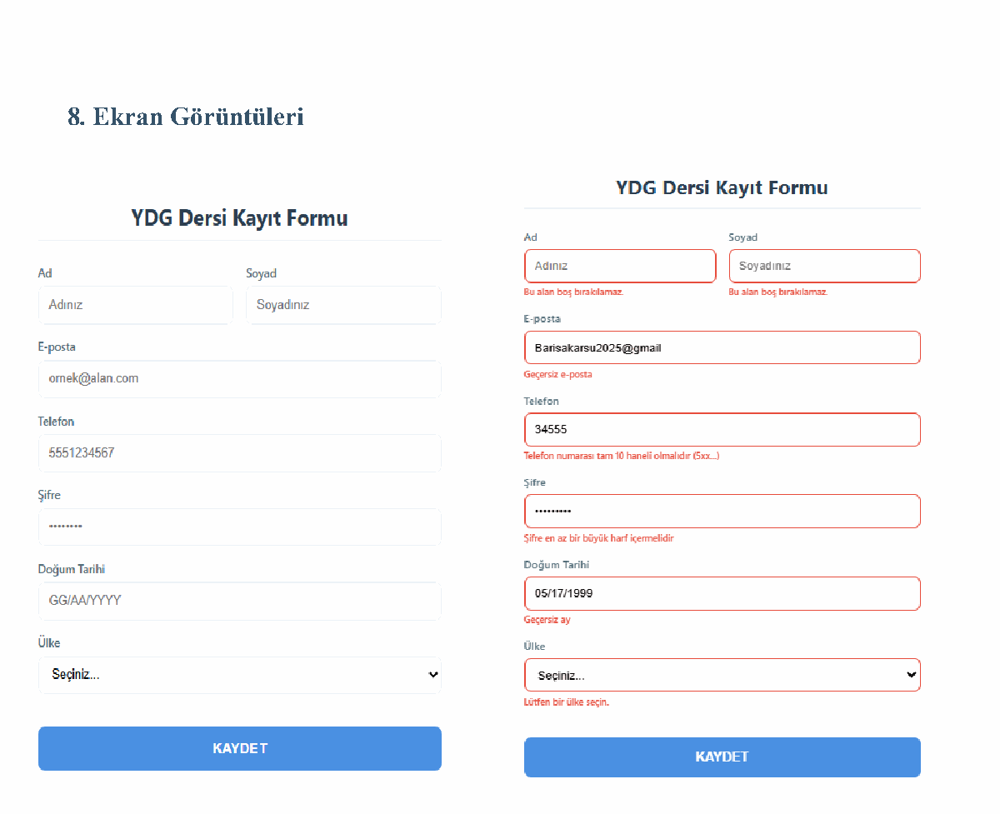

# Form Validation & Software Testing

A responsive, client-side registration form that demonstrates input validation alongside a structured manual testing approach. The project focuses on clear validation feedback, accessible form controls, and testable business rules.

> **Kısa Türkçe özet:** Kullanıcı girdilerini doğrulayan, hata mesajlarını anlaşılır biçimde gösteren ve yazılım test teknikleriyle incelenmiş web formu demonstrasyonu.

## Highlights

- Validates required fields, email format, a 10-digit phone number, and selected country.
- Applies password length, uppercase, lowercase, digit, and special-character rules.
- Validates real calendar dates, including month/day combinations and leap-year behavior.
- Uses inline error messages, `aria-invalid`, responsive layout, and keyboard-friendly controls.
- Includes input normalization for phone numbers and date formatting.

## Testing scope

The original project documentation covers 11 manual test techniques and scenarios, including equivalence partitioning, boundary values, decision tables, state transitions, use cases, statement/branch coverage, exploratory, random, risk-based, and smoke testing.

The included screenshot is a real validation-state capture from the project's test documentation. Multi-contributor academic reports are intentionally not republished here; this repository concentrates on the runnable implementation and its verifiable behavior.

## Run locally

No build tool or server is required.

1. Clone or download this repository.
2. Open `index.html` in a modern browser.
3. Try invalid inputs first, then submit valid values to see the confirmation dialog.

## Test data examples

| Field | Valid | Invalid |
| --- | --- | --- |
| Email | `user@example.com` | `user.com` |
| Phone | `5551234567` | `55512` |
| Password | `Secure1!` | `password` |
| Birth date | `15/05/1990` | `31/02/2024` |

## Tech

HTML5, CSS3, vanilla JavaScript
